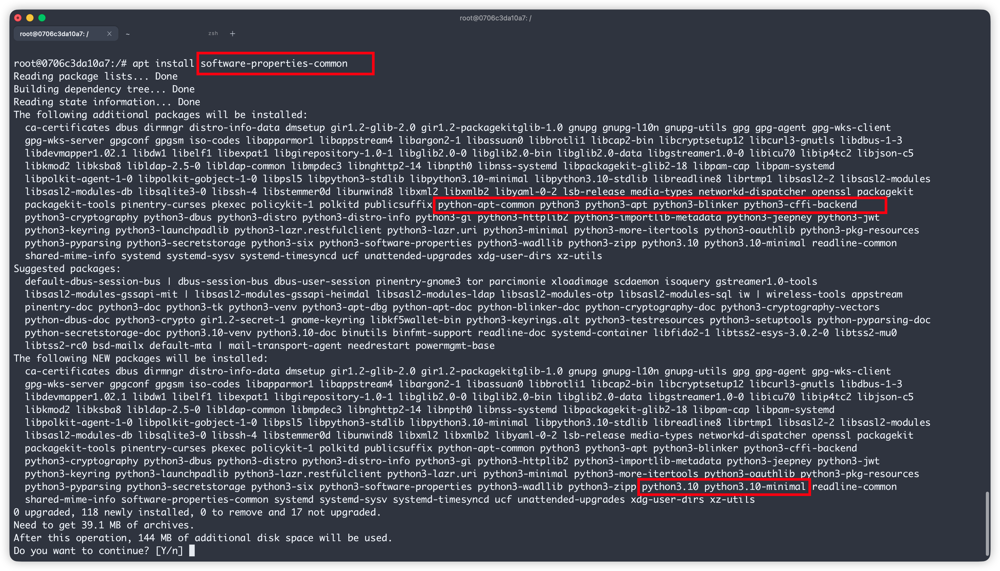
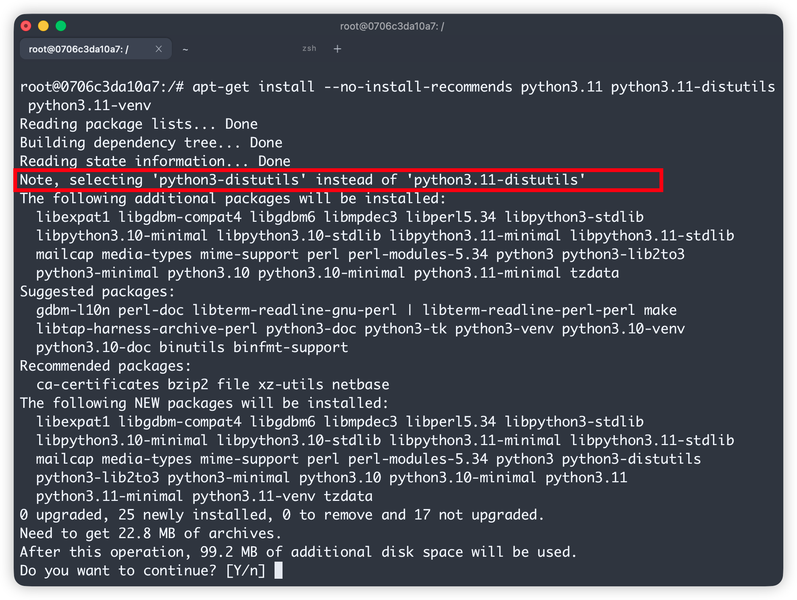
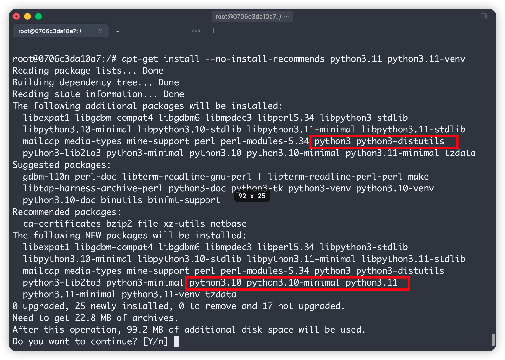

> 场景：在精简版 Ubuntu Docker 基础镜像中安装 非系统原生版本的 Python  与 pip，要求**镜像内只保留一套 Python**，体积尽可能小，本教程以Ubuntu 22.04 (jammy) 精简镜像为例，安装Python3.11版本进行演示，此方法适用于安装所有非系统自带的Python版本。

# 先说重点

在 Ubuntu 22.04 上安装 Python 3.11，网上最常见教程是安装社区的Python源，然后直接安装对应的Python版本：

```bash
apt install software-properties-common
add-apt-repository ppa:deadsnakes/ppa
apt install python3.11
```

**这条路在精简容器镜像里是错的**，因为它会顺手拖进 系统Python 3.10 全家桶（`software-properties-common` 和 `python3-pip` 都依赖系统自带的 `python3` → `python3.10`），镜像里出现两套 Python，体积白白多出几十 MB，且在后期pip安装依赖的时候会出现依赖冲突，pip指向系统自带的3.10版本等问题。

正确的做法是：**手动写源文件、手动导入 GPG key，只装 `python3.11` 这一个包，pip 用 `get-pip.py` 安装**。

# 标准构建做法（我最终使用的 Dockerfile)

```dockerfile
FROM ubuntu:22.04

# 1. 添加 deadsnakes 官方源 + 导入 GPG key + 安装 python3.11 + 安装 pip + 清理
RUN apt-get update \
 # 临时工具：gnupg 用于导入 key，wget/ca-certificates 用于下载 get-pip.py
 && apt-get install -y --no-install-recommends gnupg wget ca-certificates \
 # 手动添加 deadsnakes 官方源（jammy = Ubuntu 22.04）
 && echo 'deb http://ppa.launchpad.net/deadsnakes/ppa/ubuntu jammy main' > /etc/apt/sources.list.d/deadsnakes.list \
 # 注意 这个BA6932366A755776这个key可能会发生变化 请根据实际进行修改
 && apt-key adv --keyserver keyserver.ubuntu.com --recv-keys BA6932366A755776 \
 && apt-get update \
 # 只装 python3.11，不装 venv/distutils（会拖入 python3.10 全家桶）
 && apt-get install -y --no-install-recommends python3.11 \
 # 下载 get-pip.py 下载get-pip.pykennel会遇见网络问题 可以先下载再拷贝进去
 && wget -q https://bootstrap.pypa.io/get-pip.py \
 # 使用阿里镜像源安装 pip
 && python3.11 get-pip.py -i https://mirrors.aliyun.com/pypi/simple --trusted-host mirrors.aliyun.com \
 && rm -f get-pip.py \
 # python / python3 / pip / pip3 全部指向 3.11
 && ln -sf /usr/bin/python3.11 /usr/bin/python3 \
 && ln -sf /usr/bin/python3.11 /usr/bin/python \
 && ln -sf /usr/local/bin/pip3.11 /usr/bin/pip3 \
 && ln -sf /usr/local/bin/pip3.11 /usr/bin/pip \
 # 配置默认阿里 pip 镜像源
 && pip config set global.index-url https://mirrors.aliyun.com/pypi/simple \
 && pip config set install.trusted-host mirrors.aliyun.com \
 # 瘦身：卸载临时工具，清理缓存
 && apt-get purge -y --auto-remove gnupg wget \
 && rm -rf /var/lib/apt/lists/* /root/.cache

# 构建时验证版本
RUN python --version && pip --version
```

要点速览：

| 事项      | 做法                                                            |
| ------- | ------------------------------------------------------------- |
| 添加 PPA  | 手动写 `sources.list.d`，不用 `add-apt-repository`                  |
| GPG key | `apt-key adv --recv-keys BA6932366A755776`（以报错为准）             |
| 安装包     | **只装 `python3.11`**，不装 `-venv` / `-distutils` / `python3-pip` |
| 安装 pip  | `get-pip.py`，加 `-i` 走国内镜像                                     |
| 瘦身      | `--no-install-recommends` + purge 临时工具 + 清缓存                  |

理论上，此方法适用于所有Python版本，请根据需要自行修改。

---

# 试错过程详解

下面按时间顺序还原整个排查过程，每一步的报错都是理解 apt 依赖机制的好素材。

## 第一步：为什么不能用 `add-apt-repository`

`add-apt-repository` 命令由 `software-properties-common` 包提供，而这个包本身是用 Python 写的，依赖系统的 `python3`：

```
software-properties-common → python3 → python3.10
```

在官方 Ubuntu 22.04 镜像上执行 `apt install software-properties-common`，你会看到 Python 3.10 被一并装进来。对桌面系统无所谓，但对一个需要用于生产环境的基础镜像来说，纯纯挖坑，很容易后期pip安装环境的时候造成影响。


所以，需要想办法绕开该工具，手动添加源。PPA 本质上就是一个 apt 源 + 一个 GPG key，直接可以分成两个命令完成。

## 第二步：手动添加源

```bash
echo 'deb http://ppa.launchpad.net/deadsnakes/ppa/ubuntu jammy main' > /etc/apt/sources.list.d/deadsnakes.list
apt-get update
```

第一次 `update` 必然报错：

```
Err:6 http://ppa.launchpad.net/deadsnakes/ppa/ubuntu jammy InRelease
  The following signatures couldn't be verified because the public key is not available: NO_PUBKEY BA6932366A755776
```

这是预期的——源的签名校验需要对应的公钥。报错里的 `BA6932366A755776` 就是要导入的 key ID：

```bash
apt-get install -y gnupg
apt-key adv --keyserver keyserver.ubuntu.com --recv-keys BA6932366A755776
apt-get update
```

成功后源正常拉取。此时可能出现一个警告：

```
W: ... Key is stored in legacy trusted.gpg keyring (/etc/apt/trusted.gpg) ...
```

这只是提示 key 存进了老的全局 keyring，**是警告不是错误**，功能无影响。追求规范的话可以用 `gpg --dearmor` 导出到 `/etc/apt/trusted.gpg.d/` 并配合源配置里的 `signed-by=` 参数。

如果 keyserver 连不通（容器网络常见），换 80 端口：

```bash
apt-key adv --keyserver hkp://keyserver.ubuntu.com:80 --recv-keys BA6932366A755776
```

## 第三步：第一个坑——`python3.11-distutils` 拖入 3.10

源加好后，直觉性的安装命令是：

```bash
apt-get install -y --no-install-recommends python3.11 python3.11-distutils python3.11-venv
```

结果安装计划里赫然出现 `python3.10`、`python3`、`python3-distutils` 一堆包。日志第一行揭示了原因：

```
Note, selecting 'python3-distutils' instead of 'python3.11-distutils'
```

**deadsnakes 源里根本没有 `python3.11-distutils` 这个包**（distutils 在 3.11 已废弃、3.12 彻底移除，deadsnakes 不再单独打包）。apt 找不到这个名字后，"贴心"地回退到官方 jammy 源的 `python3-distutils`，而它依赖 `python3` → `python3.10`。


**对策**：不装 `-distutils`。现代 pip 早已不依赖 distutils，正常 `pip install` 用不到它。

## 第四步：第二个坑——`python3.11-venv` 也拖入 3.10

去掉 distutils 后再试：

```bash
apt-get install -y --no-install-recommends python3.11 python3.11-venv
```

3.10 全家桶依然出现。这次的依赖链是：

```
python3.11-venv → python3-pip-whl → python3 → python3.10
```

deadsnakes 的 venv 包需要官方源的 `python3-pip-whl` / `python3-setuptools-whl`（ensurepip 离线装 pip 用的 wheel 包），而这两个 whl 包又依赖系统 `python3`，于是绕了一圈 3.10 还是进来了。


**对策**：放弃 venv 包。如果一定要用 `ensurepip` 装 pip，可以"用完即弃"——装完执行 `python3.11 -m ensurepip --upgrade` 后立刻 `apt-get purge -y --auto-remove` 掉 venv 和全部 3.10 相关包。但更干净的办法是直接用 `get-pip.py`。

## 第五步：验证 `python3.11` 单独安装是干净的

用 `-s`（simulate）先模拟，不实际安装：

```bash
apt-get install -s --no-install-recommends python3.11 | grep 3.10
```

无输出，确认 `python3.11` 单包的依赖闭包里只有 `libpython3.11-stdlib`、`mime-support` 等 3.11 相关包。**这个模拟技巧适用于排查任何"莫名其妙多装了一堆包"的场景。**

## 第六步：用 get-pip.py 安装 pip

```bash
wget https://bootstrap.pypa.io/get-pip.py
python3.11 get-pip.py
```

功能正常，但下载 pip/setuptools/wheel 走的是默认 PyPI 源，速度只有几十 KB/s。`get-pip.py` 本质是调 pip 自举，**支持透传 pip 参数**，直接指定国内镜像：

```bash
python3.11 get-pip.py -i https://mirrors.aliyun.com/pypi/simple --trusted-host mirrors.aliyun.com
```

装完再写入全局配置，让容器里后续的 `pip install` 默认走镜像：

```bash
pip config set global.index-url https://mirrors.aliyun.com/pypi/simple
pip config set install.trusted-host mirrors.aliyun.com
```

## 第七步：命令绑定与收尾

deadsnakes 只提供 `python3.11` / `pip3.11` 这样的带版本命令，按惯例做软链接：

```bash
ln -sf /usr/bin/python3.11 /usr/bin/python3
ln -sf /usr/bin/python3.11 /usr/bin/python
ln -sf /usr/local/bin/pip3.11 /usr/bin/pip3
ln -sf /usr/local/bin/pip3.11 /usr/bin/pip
```

最后在 Dockerfile 同一层 RUN 里 purge 掉临时工具（gnupg、wget）并清理 apt/pip 缓存，避免把垃圾留在镜像层里。

# 经验总结

1. **`software-properties-common`、`python3-pip`、`python3.11-venv` 这三个包在精简镜像里都是 3.10 的入口**，想保持单版本 Python 就全都别装。
2. **apt 找不到包名时会静默回退到提供同名虚拟包的其他包**（`Note, selecting ...`），排错时先看日志头几行。
3. **排查多余依赖的小办法**：`apt-get install -s`（模拟安装）、`apt-cache depends <pkg>`（看正向依赖链）、`apt-cache rdepends <pkg>`（看谁依赖它）。
4. **PPA = 一行 deb 源 + 一个 GPG key**，手动添加永远比 `add-apt-repository` 干净，key ID 从 `NO_PUBKEY` 报错里拿。
5. **`get-pip.py` 支持 pip 参数透传**（`-i`、`--trusted-host`），内网/国内环境下可以加一下，会方便很多。
