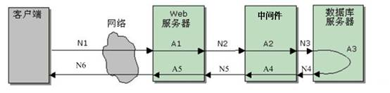

## 什么是高并发

高并发是一种系统在运行过程中，"短时间内遭遇大流量冲击"的情况。如果没有处理好，可能会造成系统吞吐量下降，响应变慢，从而影响了用户的体验，严重时甚至会导致系统彻底无法对外提供服务的情况。所以，我们需要通过优化系统（包括硬件、网络、应用、数据库等组件）的方式来达到高并发的要求。

## 高并发常见指标

### 响应时间 (Response Time)

响应时间（Response Time）指的是从请求端发起请求开始，到请求端接收到服务器端的返回结束，这个过程所耗费的时间。它完整地记录了对应系统处理请求交易的时间。

根据定义，响应时间就是 **网络传输时间 + 业务处理时间**：

- 网络传输时间：N1 + N2 + N3 + N4 + N5 + N6
- 业务处理时间：A1 + A2 + A3 + A4 + A5

最终可以计算出响应时间为：**N1 + N2 + N3 + N4 + N5 + N6 + A1 + A2 + A3 + A4 + A5**

### 吞吐量 (Throughput)

吞吐量指单位时间内系统所处理的用户请求数。

可以从两个角度去分析这个用户请求数：

- **业务角度**：可以使用"请求数/秒"、"人数/天"或者"业务处理数/小时"等单位去衡量。
- **网络角度**：可以使用"字节数/秒"来衡量。

吞吐量一般可以直接去反应系统的负载能力。不同表示方式的吞吐量可以反应不同层次的问题。

例如：

- **"请求数/秒"**：更多的说明了应用服务器以及应用本身的负载能力
- **"字节数/秒"**：更多的说明了网络基础设施、网络架构以及应用服务器之间的一个约束关系。

### 每秒请求数 (QPS)

每秒 QPS 指的是系统在一秒内总共处理的请求数量，主要用来表示**"读的请求"**。

通常单台服务器的 QPS 可以通过压测的方式得出，通过峰值 QPS 与单台服务器 QPS 的关系即可算出峰值 QPS 数。

具体的关系公式如下：

> 峰值 QPS = 单台服务器 QPS × 服务器数量

### 每秒事务数 (TPS)

TPS 指服务器的每秒事务处理数量。

TPS 一般包括下面三个过程：

1. 客户端请求服务端
2. 在服务端内部进行逻辑处理
3. 服务端响应客户端

> 如果访问一个页面，需要有三个连接，则会产生 1 个 TPS，同时产生 3 个 QPS。

### 访问量 (PV)

PV（Page View）指的是页面浏览量。

用户每对网站中的一个页面浏览一次均被记录 1 次，一个用户对同一个页面的浏览次数会被累计记录。PV 也是评价网站流量的一个重要指标。

### 独立访客 (UV)

UV（Unique Visitor）指访问某一个站点或者点击某一个链接的不同的 IP 地址数量。

在同一天内 UV 只会记录第一次进入网站的具有独立 IP 地址的访问者，在同一天内具备相同 IP 地址的访问者将不会再次被记录。这个指标可以在一定程度上反应在一定时间内有多少个独立客户端进行了访问。

> 一个 UV 可以具备多次 PV，比如说：一个客户端对同一个页面进行了两次访问，PV 数量会增加 2，但是 UV 数量只会增加 1。
